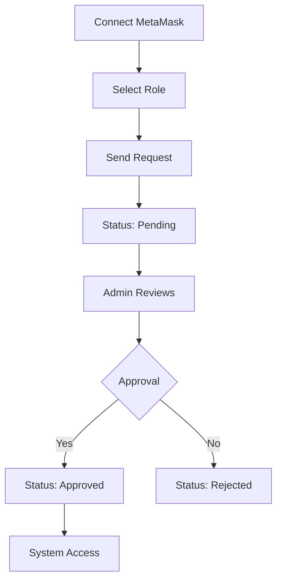
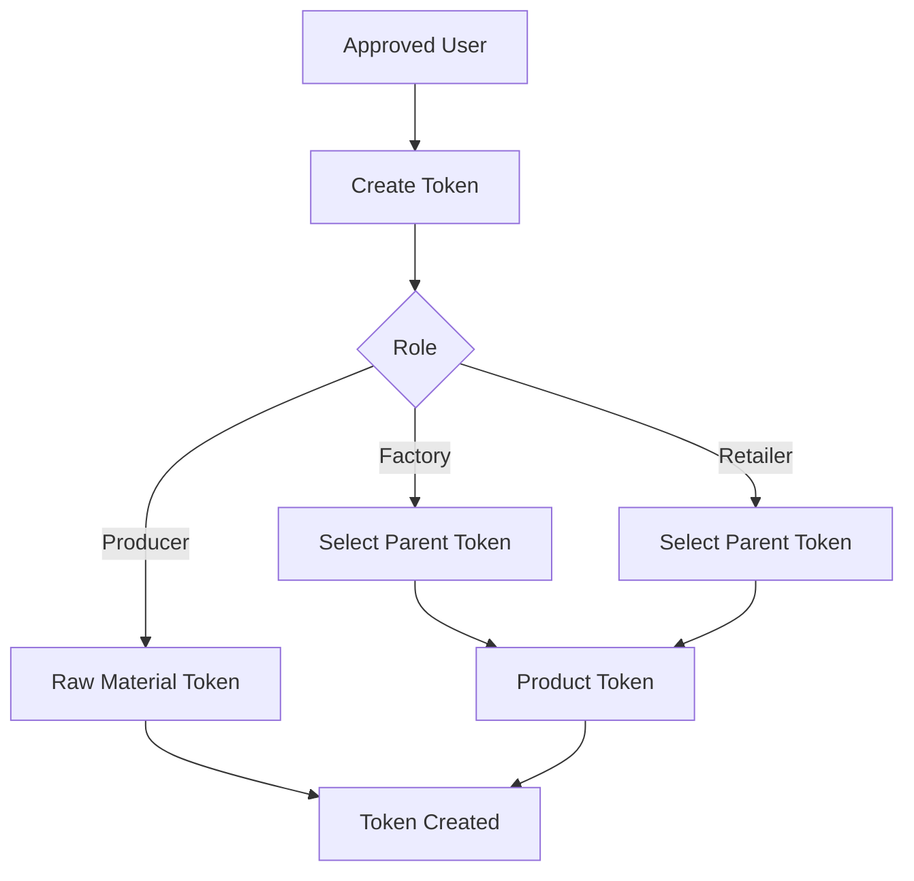
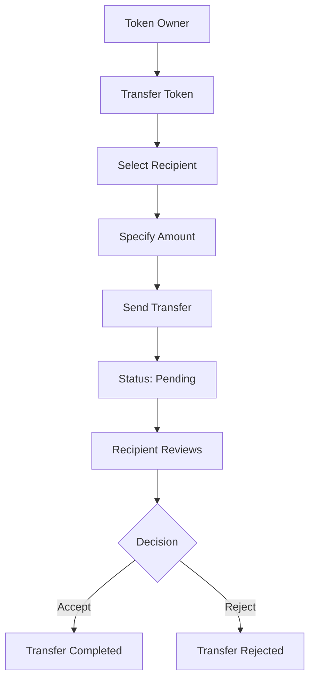

# 🔗 Supply Chain Tracker - Blockchain Development Project


> **🇪🇸 [Spanish Version](./README.md)** | **🇬🇧 English Version**

## 🎯 Project Objectives

**Supply Chain Tracker** is an educational project where you will develop from scratch a complete decentralized application (DApp) for managing supply chain traceability.

### 📚 Learning Objectives

1. **Smart Contract Development**: Program smart contracts in Solidity from scratch
2. **Blockchain Testing**: Write and pass unit tests with Foundry
3. **Decentralized Applications (DApps)**: Build a complete frontend that interacts with blockchain
4. **Role and Permission Management**: Implement a role request system with administrator approval
5. **Web3 Integration**: Connect web applications with MetaMask and Ethereum
6. **Full-Stack Development**: Combine modern frontend technologies with blockchain

### AI-Related Objectives

1. Use of Artificial Intelligence for project development
2. Retrospective of AI usage (CREATE AN IA.md FILE)
   2.1. AIs used
   2.2. Approximate time consumed, separating smart contract and frontend
   2.3. Most common errors analyzing AI chats
   2.4. AI chat files
3. Construction of an MCP that wraps Foundry CLI (anvil, cast, forge)
4. Optional. Smart contract management in the application with AI

### 🏗️ Technical Objectives

Your final application must implement:
- **Transparent and secure system** to track products from origin to final consumer
- **Tokenization** of raw materials and finished products
- **Controlled flow** between actors: Producer → Factory → Retailer → Consumer
- **Role management** with administrator approval
- **Intuitive interface** for all system roles

### 🖼️ Application Preview

Reference implementation. (url)
---

## 🏭 System Actors

### 1. 👨‍🌾 **Producer**
- **Function**: Registers raw materials in the system
- **Permissions**: Create raw material tokens, transfer only to Factory
- **Examples**: Farms, mines, agricultural producers

### 2. 🏭 **Factory**
- **Function**: Transforms raw materials into finished products
- **Permissions**: Receive from Producer, create derived products, transfer only to Retailer
- **Examples**: Processing plants, manufacturers

### 3. 🏪 **Retailer**
- **Function**: Distributes products to consumers
- **Permissions**: Receive from Factory, transfer only to Consumer
- **Examples**: Stores, supermarkets, distributors

### 4. 🛒 **Consumer**
- **Function**: End point of the chain
- **Permissions**: Receive products, consult complete traceability
- **Examples**: End users, customers

### 5. 👑 **Admin**
- **Function**: Manages the system and approves users
- **Permissions**: Approve/reject registrations, supervise the system
- **Note**: Unique role of the contract creator

---

## 🛠️ Prerequisites and Installation

### 📋 System Requirements

Before starting, make sure you have installed:

1. **Node.js** (version 18 or higher)
   ```bash
   # Check version
   node --version
   npm --version
   ```

2. **Git**
   ```bash
   git --version
   ```

3. **Foundry** (for smart contracts)
   ```bash
   # Install Foundry
   curl -L https://foundry.paradigm.xyz | bash
   foundryup

   # Verify installation
   forge --version
   anvil --version
   ```

4. **MetaMask Browser Extension**
   - Install from [metamask.io](https://metamask.io/)
   - Create a test wallet

### 🔧 Environment Setup

#### 1. **Clone the Repository**
```bash
git clone 98_pfm_traza_2025

cd supply-chain-tracker
```

#### 2. **Setup Smart Contracts (`sc/`)**
```bash
cd sc

# Install Foundry dependencies
forge install

# Compile contracts
forge build

# Run tests (optional but recommended)
forge test

# Verify everything works
ls out/  # Should show compiled files
```

#### 3. **Setup Frontend (`web/`)**
```bash
npx create-next-app@latest web --typescript 

cd ../web

# Install Node.js dependencies
npm install

# Verify no errors
npm run build
```

#### 4. **Setup Local Blockchain**

**Terminal 1 - Run Anvil:**
```bash
# Start local blockchain
anvil

# Copy the private keys that appear
# Example output:
# Account #0: 0xf39Fd6e51aad88F6F4ce6aB8827279cffFb92266
# Private Key: 0xac0974bec39a17e36ba4a6b4d238ff944bacb478cbed5efcae784d7bf4f2ff80
```

**Terminal 2 - Deploy Contract:**
```bash
cd sc

# Deploy contract (use an Anvil private key)
forge script script/Deploy.s.sol \
  --rpc-url http://localhost:8545 \
  --private-key 0xac0974bec39a17e36ba4a6b4d238ff944bacb478cbed5efcae784d7bf4f2ff80 \
  --broadcast

# Copy the deployed contract address
```

#### 5. **Configure MetaMask**

1. **Add Local Network:**
   - Network Name: `Anvil Local`
   - RPC URL: `http://localhost:8545`
   - Chain ID: `31337`
   - Currency Symbol: `ETH`

2. **Import Test Accounts:**
   - Import Anvil private keys for testing
   - Recommended: at least 4 different accounts

#### 6. **Update Configuration**

**File: `web/src/contracts/config.ts`**
```typescript
export const CONTRACT_CONFIG = {
  address: "0x...", // Deployed contract address
  abi: SupplyChainABI,
  adminAddress: "0xf39Fd6e51aad88F6F4ce6aB8827279cffFb92266" // First Anvil account
};
```

#### 7. **Start Application**
```bash
cd web

# Development mode
npm run dev

# Open http://localhost:3000
```

---

## 🚀 Features to Implement

### 🔐 **Web3 Authentication System**
You must code:
- **MetaMask Connection**
- **localStorage Persistence** - maintains session on reload
- **Automatic Disconnection** - clears localStorage data
- **Account Change Detection** - automatically reconnects

### 💳 **User Management**
Your implementation must include:
- **Role Registration**
- **Administrator Approval** before using the system
- **States**: Pending, Approved, Rejected, Canceled

### 🪙 **Token System**
You will develop:
- **Token Creation** representing products/raw materials
- **JSON Metadata** for product characteristics
- **Parent System** - products derive from raw materials
- **Individual Balance** per user and token

### 📦 **Controlled Transfers**
You will implement:
- **Directed Flow**: Producer → Factory → Retailer → Consumer
- **Approval System** - receiver must accept
- **Automatic Validation** of permissions by role
- **Complete Traceability** of movements

### 🎨 **Modern Interface**
You will create:
- **Responsive Design** with Tailwind CSS
- **Reusable Components** with Shadcn UI
- **Intuitive Navigation** according to user role

---

## 📱 Application Structure

### 🌐 **Main Pages**

#### **`/` - Main Page**
- **Not Connected**: Invitation to connect MetaMask
- **Connected but not registered**: Role registration form
- **Connected and pending**: Waiting for approval status
- **Connected and approved**: Welcome with dashboard access

#### **`/dashboard` - Main Panel**
- **Personalized Summary** according to role
- **Statistics** of tokens and transfers
- **Quick Access** to main functionalities

#### **`/tokens` - Token Management**
- **Token List** owned by user
- **Create Token** (`/tokens/create`)
- **Details** (`/tokens/[id]`)
- **Transfer** (`/tokens/[id]/transfer`)

#### **`/transfers` - Transfers**
- **Pending Acceptance**
- **Complete History**
- **Actions**: Accept/Reject

#### **`/admin` - Administration** (Admin only)
- **System Administration Panel**
- **User Management** (`/admin/users`)

#### **`/profile` - Profile**
- **User Information**
- **Token Portfolio**

---

## 🔄 Workflows

### 1. **User Registration**


### 2. **Token Creation**


### 3. **Transfer**


---

## 📚 Additional Resources

### **Official Documentation**
- [Solidity Docs](https://docs.soliditylang.org/)
- [Foundry Book](https://book.getfoundry.sh/)
- [Next.js Docs](https://nextjs.org/docs)
- [Ethers.js Docs](https://docs.ethers.org/)

### **Recommended Tutorials**
- [CryptoZombies](https://cryptozombies.io/) - Learn Solidity
- [Buildspace](https://buildspace.so/) - Web3 Projects
- [Next.js Tutorial](https://nextjs.org/learn) - React and Next.js

### **Development Tools**
- [Remix IDE](https://remix.ethereum.org/) - Online Solidity Editor
- [Hardhat](https://hardhat.org/) - Foundry Alternative
- [OpenZeppelin](https://openzeppelin.com/) - Secure Contracts

---

## ✅ Development Checklist

### **🔧 INITIAL SETUP**
- [ ] Node.js (18+) and npm installed and verified
- [ ] Foundry installed (`curl -L https://foundry.paradigm.xyz | bash`)
- [ ] MetaMask installed and configured
- [ ] Folder structure created from scratch
- [ ] Anvil running on port 8545

### **⚡ SMART CONTRACT**
- [ ] `SupplyChain.sol` programmed with all structures
- [ ] Enums `UserStatus` and `TransferStatus` defined
- [ ] Structs `Token`, `Transfer`, `User` implemented
- [ ] All public functions programmed
- [ ] Access modifiers implemented
- [ ] Deploy script `Deploy.s.sol` created
- [ ] Unit tests written and **ALL PASSING** ✅
- [ ] Contract successfully deployed on Anvil

### **🌐 FRONTEND**
- [ ] Next.js project initialized with TypeScript
- [ ] Dependencies installed (ethers, tailwind, radix-ui)
- [ ] `Web3Context` programmed with localStorage
- [ ] Hook `useWallet` implemented
- [ ] Service `Web3Service` created
- [ ] Contract configuration updated
- [ ] All pages created and working

### **🔗 INTEGRATION**
- [ ] MetaMask connection working
- [ ] User registration by role implemented
- [ ] Admin approval operational
- [ ] Token creation with metadata
- [ ] Complete transfer system
- [ ] Accept/reject transfers working
- [ ] Product traceability visible
- [ ] localStorage persistence implemented

---

## 🎯 Evaluation Criteria (Total: 10 points)

#### **📊 POINT DISTRIBUTION**

**🔥 SMART CONTRACT (4.0 points)**
- Structures and Functions
- Unit Tests
- Deploy and Configuration

**🌐 FRONTEND (3.0 points)**
- Pages and Navigation
- Web3 Integration
- UI/UX and Components
- Complete User Flow
- Traceability and Permissions

**📝 CODE QUALITY (0.5 points)**
- Organization and Cleanliness
- Documentation

#### **⭐ EXTRAS 1 point**
- Exceptional Quality
- Testnet Deployment

#### **⭐ PRESENTATION VIDEO MAX 5 MINUTES (1.5 points)**
- Video Presentation
- Fully Working Demo

#### **❌ PENALTIES**
- Failing tests: -1.0 pt per critical test that fails
- Non-functional application: -2.0 pts if it cannot be executed
- Smart contract without deploy: -1.5 pts
- No MetaMask connection: -1.0 pt
- Code without comments: -0.5 pts

#### **📋 MINIMUM TO PASS: 6.0/10**

To obtain the minimum passing grade you must meet:
- ✅ Smart contract deployed with basic tests passing
- ✅ Frontend connecting with MetaMask
- ✅ At least 3 main pages working
- ✅ Basic registration and token flow operational

---

## 🎉 Start Your Development!

**Remember**: This is a challenging but very rewarding project. You only have this README and the reference images - all the code must be created by you!

**Next steps**:
1. 📋 Study this README and the reference images well
2. 🛠️ Set up your development environment
3. ⚡ Start with the smart contract and make the tests pass
4. 🌐 Build the frontend step by step
5. 🔗 Integrate everything and test the complete flow

Happy programming! 🚀💻🔗

