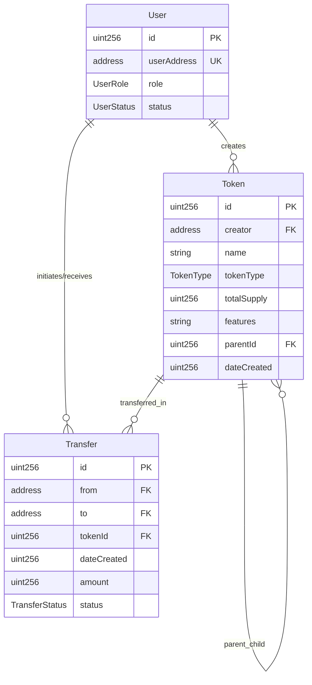
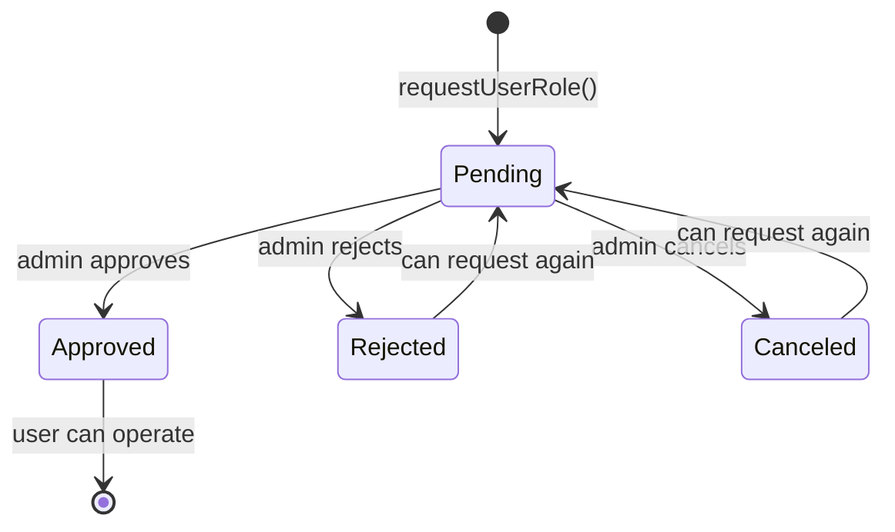
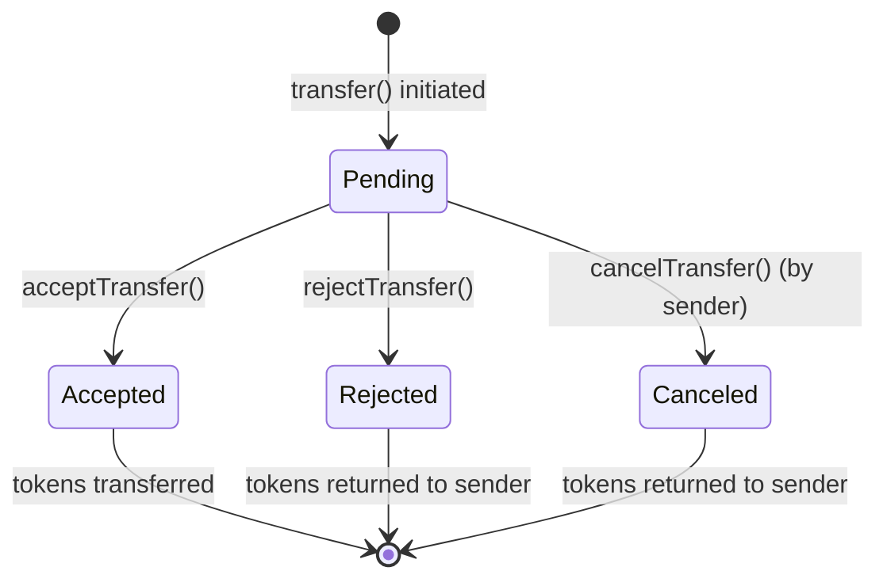

# 📚 Smart Contract - Complete Documentation

> **📋 For the most up-to-date project status, see [STATUS.md](../../STATUS.md)**

Complete documentation of the Smart Contract SupplyChain.sol, developed with Solidity 0.8.30 and Foundry.

**Last Updated**: November 27, 2025

---

## 📋 Table of Contents

1. [Executive Summary](#executive-summary)
2. [Getting Started](#getting-started)
3. [Architecture](#architecture)
4. [API Reference](#api-reference)
5. [Testing](#testing)
6. [Deployment](#deployment)
7. [Security](#security)
8. [Scripts and Automation](#scripts-and-automation)

---

## 🧭 Executive Summary

### In Spanish

This project presents the design and implementation of a comprehensive traceability system in a supply chain using blockchain technology, developed in Solidity as part of a Master's Final Project (PFM). The smart contract `SupplyChain.sol` implements a complete model of user management, token creation and transfer, and role control with a focus on security, efficiency, and maintainability.

**Key Features**:
- ✅ **108 Tests**: 64 core + 44 edge cases with scientific methodology
- ✅ **Exceptional Coverage**: 85.60% lines, 82.67% statements, 72.15% branches, 80.95% functions
- ✅ **Enterprise Security**: ReentrancyGuard, Pausable, Access Control
- ✅ **Ownership Transfer**: Two-step ownership transfer (initiate, accept/reject)
- ✅ **Professional Documentation**: Complete suite of technical documents

### In English

The **SupplyChain Smart Contract Project** demonstrates a fully functional, secure, and optimized blockchain-based supply chain management system built with Solidity. It integrates advanced role management, token traceability, ownership control, and emergency pause mechanisms, following enterprise-grade security and gas optimization standards.

---

## 🚀 Getting Started

### Prerequisites

- **Foundry** (forge, cast, anvil) - [Install Guide](https://book.getfoundry.sh/getting-started/installation)
- **Git** - Version control
- **Node.js** v16+ (optional, for frontend integration)

### Installation

```bash
# Clone repository
git clone <repository-url>
cd sc

# Install dependencies
forge install

# Verify installation
forge build
```

### Quick Start Workflow

#### Option 1: Local Testing (Recommended)
```bash
# Run tests
forge test

# Check coverage
forge coverage

# Run validation
bash validate-all.sh
```

#### Option 2: Full Stack Deployment (Recommended)
```bash
# Use deploy.sh for complete automation (Anvil + Contract + Frontend)
./deploy.sh start

# For more details, see:
# - [QUICKSTART.md](../../QUICKSTART.md)
# - [deploy.sh](../../deploy.sh)
```

#### Option 3: Local Deployment (Manual)
```bash
# Terminal 1: Start local blockchain
anvil

# Terminal 2: Deploy contract
export PRIVATE_KEY=0xac0974bec39a17e36ba4a6b4d238ff944bacb478cbed5efcae784d7bf4f2ff80
forge script script/SupplyChainDeploy.s.sol \
    --rpc-url http://localhost:8545 \
    --broadcast
```

### Configuration

#### Environment Variables
```bash
# Create .env file (never commit this!)
PRIVATE_KEY=0x...                    # Deployer private key
SEPOLIA_RPC_URL=https://...          # Alchemy/Infura RPC endpoint
MAINNET_RPC_URL=https://...
ETHERSCAN_API_KEY=...                # For contract verification
```

#### Foundry Configuration
Check `foundry.toml` for project settings:
- Solidity version: 0.8.30
- Optimizer: Enabled with 200 runs
- Test verbosity: Medium
- Coverage: Enabled

---

## 🏗️ Architecture

### Project Purpose

This project presents an exceptional Solidity smart contract, `SupplyChain.sol`, which implements a **complete and robust supply chain**. Its main objective is **educational** and serves as an **exemplary central piece** for a **high-quality** Master's Final Project (PFM).

### Architecture Diagrams

#### 1. Entity Relationship Diagram



#### 2. User State Flow



#### 3. Transfer State Flow



#### 4. Role and Permission Architecture

```
Producer → Factory → Retailer → Consumer
   │          │          │          │
   │          │          │          └─ Only receives
   │          │          └─ Can send & receive
   │          └─ Can send & receive
   └─ Only sends (produces raw materials)
```

### Data Structures

#### User
```solidity
struct User {
    uint256 id;
    address userAddress;
    UserRole role;
    UserStatus status;
}
```

#### Token
```solidity
struct Token {
    uint256 id;
    address creator;
    string name;
    TokenType tokenType;
    uint256 totalSupply;
    string features;
    uint256 parentId;
    uint256 dateCreated;
    mapping(address => uint256) balance;
}
```

#### Transfer
```solidity
struct Transfer {
    uint256 id;
    address from;
    address to;
    uint256 tokenId;
    uint256 amount;
    TransferStatus status;
    uint256 dateCreated;
}
```

### Enums

```solidity
enum UserRole { Producer, Factory, Retailer, Consumer }
enum UserStatus { Pending, Approved, Rejected, Canceled }
enum TokenType { RowMaterial, FinishedProduct }
enum TransferStatus { Pending, Accepted, Rejected, Canceled }
enum PauseRole { None, Pauser }
```

---

## 📖 API Reference

### Modifiers

#### `onlyOwner`
Restricts function access to the contract owner only.
```solidity
modifier onlyOwner()
```
**Reverts:** `NoOwner()` if caller is not the owner

#### `onlyPauser`
Restricts function access to owner or accounts with Pauser role.
```solidity
modifier onlyPauser()
```
**Reverts:** `NoPauser()` if caller lacks pauser privileges

#### `whenNotPaused`
Ensures function can only execute when contract is not paused.
```solidity
modifier whenNotPaused()
```
**Reverts:** `EnforcedPause()` if contract is paused

#### `onlyTokenCreators`
Restricts token creation to approved Producers and Factories.
```solidity
modifier onlyTokenCreators()
```
**Reverts:** `Unauthorized()` if caller is not an approved Producer/Factory

#### `onlyTransfersAllowed`
Allows transfer initiation for approved Producers, Factories, and Retailers.
```solidity
modifier onlyTransfersAllowed()
```
**Reverts:** `NoTransfersAllowed()` if caller lacks transfer privileges

#### `onlyReceiverAllowed`
Restricts transfer acceptance to approved Factories, Retailers, and Consumers.
```solidity
modifier onlyReceiverAllowed()
```
**Reverts:** `NoTransfersAllowed()` if caller cannot receive transfers

### Ownership Management Functions

#### `initiateOwnershipTransfer(address newOwner)`
Initiates the two-step ownership transfer process.

**Parameters:**
- `newOwner`: Address of the proposed new owner

**Requirements:**
- Caller must be current owner
- `newOwner` cannot be `address(0)`

**Events Emitted:**
- `OwnershipTransferInitiated(address indexed previousOwner, address indexed newOwner)`

#### `acceptOwnershipTransfer()`
Completes ownership transfer by allowing pending owner to accept.

**Requirements:**
- Caller must be the `pendingOwner`
- Caller must never have requested a user role
- Contract must not be paused

**Events Emitted:**
- `OwnershipTransferred(address indexed previousOwner, address indexed newOwner)`

#### `rejectOwnershipTransfer()`
Allows owner or pending owner to reject/cancel the ownership transfer.

**Requirements:**
- Caller must be the current `owner` OR the `pendingOwner`
- Contract must not be paused

### Pause Management Functions

#### `setPauseRole(address account, PauseRole role)`
Assigns or revokes the Pauser role to/from an account.

#### `pause()`
Pauses critical contract functions (emergency stop).

**Requirements:**
- Caller must be owner or have Pauser role
- Contract must not already be paused

#### `unpause()`
Resumes contract functionality after pause.

**Requirements:**
- Caller must be owner or have Pauser role
- Contract must be paused

### User Management Functions

#### `requestUserRole(UserRole role)`
Allows a user to request a role in the supply chain.

**Parameters:**
- `role`: Desired role (Producer, Factory, Retailer, Consumer)

**Requirements:**
- User must not already be registered (for new users)
- Owner cannot request a role
- Contract must not be paused

**Behavior for Existing Users:**
- **Pending users**: Can change to a different role, but cannot request the same role again
- **Rejected users**: Can request any role, including the same role they were rejected for (allows re-application after resolving administrative issues)
- **Approved users**: Cannot change role (must be canceled first by admin)
- **Canceled users**: Cannot request any new role

**Special Case - Rejected Users:**
Users with `Rejected` status can re-request the same role they were rejected for. This allows users who were rejected due to administrative issues (e.g., missing documentation) to re-apply after resolving the problem, without requiring admin intervention to change their status first.

#### `changeStatusUser(address userAddress, UserStatus newStatus)`
Allows admin to change user status (approve, reject, cancel).

**Parameters:**
- `userAddress`: Address of the user
- `newStatus`: New status (Approved, Rejected, Canceled)

**Requirements:**
- Caller must be owner
- User must exist
- Status must be valid transition

#### `changeRole(address userAddress, UserRole newRole)`
Allows admin to change user role.

**Parameters:**
- `userAddress`: Address of the user
- `newRole`: New role

**Requirements:**
- Caller must be owner
- User must exist and be approved

### Token Management Functions

#### `createToken(string memory name, TokenType tokenType, uint256 totalSupply, string memory features, uint256 parentId)`
Creates a new token in the supply chain.

**Parameters:**
- `name`: Token/product name
- `tokenType`: RowMaterial or FinishedProduct
- `totalSupply`: Total amount created
- `features`: JSON string with product characteristics
- `parentId`: Reference to parent token (0 for raw materials)

**Requirements:**
- Caller must be approved Producer or Factory
- If FinishedProduct, parentId must be valid and caller must have balance
- Contract must not be paused

### Transfer Management Functions

#### `transfer(address to, uint256 tokenId, uint256 amount)`
Initiates a transfer of tokens to another user.

**Parameters:**
- `to`: Recipient address
- `tokenId`: Token to transfer
- `amount`: Quantity to transfer

**Requirements:**
- Caller must be approved Producer, Factory, or Retailer
- Caller must have sufficient balance
- Recipient must have correct role for supply chain flow
- Contract must not be paused

#### `acceptTransfer(uint256 transferId)`
Accepts a pending transfer.

**Parameters:**
- `transferId`: ID of the transfer to accept

**Requirements:**
- Caller must be the recipient
- Transfer must be in Pending status
- Caller must be approved Factory, Retailer, or Consumer
- Contract must not be paused

#### `rejectTransfer(uint256 transferId)`
Rejects a pending transfer.

**Parameters:**
- `transferId`: ID of the transfer to reject

**Requirements:**
- Caller must be the recipient
- Transfer must be in Pending status
- Caller must be approved Factory, Retailer, or Consumer
- Contract must not be paused

#### `cancelTransfer(uint256 transferId)`
Cancels a pending transfer initiated by the caller.

**Parameters:**
- `transferId`: ID of the transfer to cancel

**Requirements:**
- Caller must be the sender
- Transfer must be in Pending status
- Caller must be approved Producer, Factory, or Retailer
- Contract must not be paused

### View Functions

#### `getUserInfo(address userAddress)`
Returns complete user information.

**Returns:**
- `User`: User struct with id, address, role, status

#### `getToken(uint256 tokenId)`
Returns complete token information.

**Returns:**
- Token data: id, name, tokenType, totalSupply, creator, parentToken, createdAt, features

#### `getUserTokens(address userAddress)`
Returns array of token IDs owned by user.

**Returns:**
- `uint256[]`: Array of token IDs

**⚠️ Gas Warning**: This function iterates over all tokens. Consider off-chain indexing for production.

#### `getUserTransfers(address userAddress)`
Returns array of transfer IDs for user (sent and received).

**Returns:**
- `uint256[]`: Array of transfer IDs

**⚠️ Gas Warning**: This function iterates over all transfers. Consider off-chain indexing for production.

### Events

#### User Events
- `UserRoleRequested(address indexed user, UserRole role)`
- `UserStatusChanged(address indexed user, UserStatus oldStatus, UserStatus newStatus)`
- `UserRoleChanged(address indexed user, UserRole oldRole, UserRole newRole)`

#### Token Events
- `TokenCreated(uint256 indexed tokenId, address indexed creator, string name, TokenType tokenType, uint256 totalSupply)`

#### Transfer Events
- `TransferInitiated(uint256 indexed transferId, address indexed from, address indexed to, uint256 tokenId, uint256 amount)`
- `TransferStatusChanged(uint256 indexed transferId, TransferStatus oldStatus, TransferStatus newStatus)`

#### Ownership Events
- `OwnershipTransferInitiated(address indexed previousOwner, address indexed newOwner)`
- `OwnershipTransferred(address indexed previousOwner, address indexed newOwner)`
- `OwnershipTransferCancelledByOwner(address indexed owner, address indexed pendingOwner)`
- `OwnershipTransferRejectedByPendingOwner(address indexed pendingOwner, address indexed owner)`

#### Pause Events
- `Paused(address account)`
- `Unpaused(address account)`
- `PauseRoleChanged(address indexed account, PauseRole oldRole, PauseRole newRole)`

### Custom Errors

```solidity
error NoOwner()
error Unauthorized()
error InvalidAddress()
error InvalidRole()
error InvalidStatus()
error UserExists()
error UserNotFound()
error NoTransfersAllowed()
error NoReceiverAllowed()
error InsufficientBalance()
error InvalidToken()
error InvalidTransfer()
error InvalidAmount()
error EnforcedPause()
error ExpectedPause()
error NoPauser()
```

### Gas Limitations

**⚠️ Important**: Some functions have gas limitations due to array iteration:

- `getUserTokens(address)`: Iterates over all tokens
- `getUserTransfers(address)`: Iterates over all transfers

**Recommendations**:
- Use off-chain indexing for production
- Consider pagination for large datasets
- Monitor gas usage in production

---

## 🧪 Testing

### Test Suite Overview

- **Total Tests**: 108 (100% passing)
  - Core Tests: 64 (SupplyChain.t.sol)
  - Edge Cases: 44 (EdgeCasesTest.t.sol)
- **Test Methodology**: Scientific 3-phase analysis
- **Coverage**: Enterprise-grade (80%+ on critical metrics)

### Current Coverage Metrics

| Metric | Coverage | Status | Standard |
|--------|----------|--------|----------|
| **Lines** | 85.60% | ✅ Excellent | >70% Good, >80% Excellent |
| **Statements** | 82.67% | ✅ Excellent | >70% Good, >80% Excellent |
| **Branches** | 72.15% | 🟡 Good | >60% Good, >75% Excellent |
| **Functions** | 80.95% | ✅ Excellent | >75% Good, >85% Excellent |

### Running Tests

```bash
# Run all tests
forge test

# Run with verbosity
forge test -vv          # Show test names
forge test -vvv         # Show execution traces
forge test -vvvv        # Show setup traces

# Run specific test file
forge test --match-path test/SupplyChain.t.sol

# Run specific test function
forge test --match-test testCreateToken

# Run with gas reporting
forge test --gas-report
```

### Test Categories

1. **User Management Tests** (8 tests)
   - User registration with role request
   - Admin approval/rejection workflow
   - User status transitions
   - Role-based permissions

2. **Token Management Tests** (8 tests)
   - Token creation by approved users
   - Token types (RawMaterial, FinishedProduct)
   - Token supply management
   - Parent-child token relationships

3. **Transfer Tests** (8 tests)
   - Transfer initiation
   - Transfer acceptance
   - Transfer rejection
   - Transfer cancellation
   - Balance updates
   - Escrow mechanics

4. **Security Tests** (9 tests)
   - Access control validation
   - ReentrancyGuard protection
   - Pausable functionality
   - Owner controls
   - Invalid state transitions

5. **Edge Cases** (44 tests)
   - Boundary conditions
   - Zero values
   - Invalid inputs
   - State conflicts
   - Race conditions
   - Scientific 3-phase analysis approach

6. **Events Tests** (6 tests)
   - UserRoleRequested emission
   - UserStatusChanged emission
   - TokenCreated emission
   - TransferInitiated emission
   - TransferStatusChanged emission

### Coverage Analysis

```bash
# Generate coverage report
forge coverage

# With specific output format
forge coverage --report summary
forge coverage --report lcov

# Coverage for specific files
forge coverage --match-path "test/SupplyChain.t.sol"
```

### Scientific Testing Methodology

#### 3-Phase Analysis Approach

**PHASE 1: Speculative Edge Cases**
- 12 unique edge cases implemented
- Coverage of unexpected scenarios
- Boundary condition testing

**PHASE 2: Duplicate Analysis**
- Identification of redundant tests
- Elimination of 6 duplicate tests
- Test suite optimization

**PHASE 3: Directed Edge Cases**
- 11 scientifically targeted tests
- Based on coverage gap analysis
- Systematic branch coverage improvement

### Validation System

#### Automated Validation Script

```bash
# Run complete validation
bash validate-all.sh

# Auto-generates report in docs/sc/reports/VALIDATION_RESULTS_HISTORICAL.md
```

#### Validation Phases (26+ checks)

**PHASE 1: Dependencies** (3/3)
- ✅ Foundry (forge) installed
- ✅ Foundry (cast) installed
- ✅ bc (calculator) installed

**PHASE 2: Compilation** (1/1)
- ✅ forge build successful

**PHASE 3: Tests** (3/3)
- ✅ Core tests (64) passing
- ✅ Edge case tests (44) passing
- ✅ Total tests (108) passing

**PHASE 4: Scripts** (2/2)
- ✅ SupplyChainDeploy.s.sol functional
- ✅ SupplyChainInteractions.s.sol functional

**PHASE 5: Coverage** (4/4)
- ✅ Lines coverage > 80%
- ✅ Statements coverage > 75%
- ✅ Branches coverage > 50%
- ✅ Functions coverage > 75%

**PHASE 6: Reporting Scripts** (2/2)
- ✅ coverage-reporter-simple.sh functional
- ✅ coverage-reporter.sh functional

**PHASE 7: File Structure** (5/5)
- ✅ All critical files present

**PHASE 8: Documentation Validation** (6/6)
- ✅ All documentation files present

---

## 🚀 Deployment

### Quick Deployment

#### Option 0: Full Stack Automated Deployment (Recommended)

**Use `deploy.sh` for complete automation:**

```bash
# Start everything (Anvil + Contract + Frontend)
./deploy.sh start

# Check status
./deploy.sh status

# Stop everything
./deploy.sh stop
```

#### Option 1: Local Development (Anvil - Manual)

**Step 1: Start Local Blockchain**
```bash
# Terminal 1: Start Anvil
anvil
```

**Step 2: Deploy Contract**
```bash
# Terminal 2: Deploy
forge script script/SupplyChainDeploy.s.sol \
    --rpc-url http://localhost:8545 \
    --broadcast
```

**Step 3: Run Interactive Demo**
```bash
# Terminal 3: Execute workflow demo
forge script script/SupplyChainInteractions.s.sol \
    --rpc-url http://localhost:8545 \
    --broadcast
```

#### Option 2: Testnet Deployment (Sepolia)

**Step 1: Configure Environment**
```bash
export PRIVATE_KEY=0x<your_private_key>
export SEPOLIA_RPC_URL=https://sepolia.infura.io/v3/<your_api_key>
export ETHERSCAN_API_KEY=<your_etherscan_api_key>
```

**Step 2: Deploy & Verify**
```bash
forge script script/SupplyChainDeploy.s.sol \
    --rpc-url $SEPOLIA_RPC_URL \
    --broadcast \
    --verify \
    --etherscan-api-key $ETHERSCAN_API_KEY \
    -vvv
```

#### Option 3: Mainnet Deployment (Production)

⚠️ **CRITICAL**: Review all code thoroughly before mainnet deployment!

**Pre-Deployment Checklist:**
- [ ] All tests passing (108/108: 64 core + 44 edge cases)
- [ ] Security audit completed
- [ ] Gas optimization reviewed
- [ ] Emergency procedures documented
- [ ] Backup deployer key secured
- [ ] Sufficient ETH for deployment (~0.5 ETH recommended)
- [ ] Post-deployment monitoring ready

**Deployment Steps:**
```bash
# 1. Final test run
forge test --match-contract "SupplyChain|EdgeCases"

# 2. Configure mainnet
export PRIVATE_KEY=0x<your_private_key>
export MAINNET_RPC_URL=https://mainnet.infura.io/v3/<your_api_key>
export ETHERSCAN_API_KEY=<your_etherscan_api_key>

# 3. Estimate gas cost
forge script script/SupplyChainDeploy.s.sol \
    --rpc-url $MAINNET_RPC_URL

# 4. Deploy with verification
forge script script/SupplyChainDeploy.s.sol \
    --rpc-url $MAINNET_RPC_URL \
    --broadcast \
    --verify \
    --etherscan-api-key $ETHERSCAN_API_KEY \
    --slow \
    -vvv
```

### Deployment Scripts

#### deploy.sh - Full Stack Automation (Recommended)

**Location:** `deploy.sh` (root directory)

**Purpose:** Complete automation for Anvil + Smart Contract + Frontend.

**Available Commands:**
- `./deploy.sh start` - Starts the entire stack
- `./deploy.sh stop` - Stops all services
- `./deploy.sh restart` - Restarts the entire stack
- `./deploy.sh status` - Shows service status
- `./deploy.sh frontend start/stop/restart` - Independent frontend management
- `./deploy.sh clean` - Cleans Anvil persistent state
- `./deploy.sh metamask` - Instructions to configure MetaMask
- `./deploy.sh help` - Complete help

#### SupplyChainDeploy.s.sol - Main Deployment Script

**Location:** `script/SupplyChainDeploy.s.sol`

**Purpose:** Automated, reproducible contract deployment for any network.

**What it does:**
1. ✅ Reads private key from environment
2. ✅ Verifies deployer balance
3. ✅ Deploys SupplyChain contract
4. ✅ Verifies owner assignment
5. ✅ Logs all deployment information

**Usage:**
```bash
# Local
forge script script/SupplyChainDeploy.s.sol --rpc-url http://localhost:8545 --broadcast

# Sepolia
forge script script/SupplyChainDeploy.s.sol \
    --rpc-url $SEPOLIA_RPC_URL \
    --broadcast \
    --verify \
    --etherscan-api-key $ETHERSCAN_API_KEY

# Mainnet
forge script script/SupplyChainDeploy.s.sol \
    --rpc-url $MAINNET_RPC_URL \
    --broadcast \
    --verify \
    --etherscan-api-key $ETHERSCAN_API_KEY
```

---

## 🔒 Security

> **📚 For comprehensive security documentation, see [SECURITY.md](./SECURITY.md)**  
> **📚 For complete security documentation in Spanish, see [SECURITY.es.md](./SECURITY.es.md)**

### Security Features Implemented

#### Access Control
- ✅ **Role-Based Access Control (RBAC)** - Admin, Producer, Factory, Retailer, Consumer roles
- ✅ **Admin Approval Required** - User registration requires owner approval
- ✅ **Function-Level Permissions** - `onlyOwner`, `onlyApprovedUser` modifiers
- ✅ **Ownable Pattern** - Secure ownership management with two-step transfer
- ✅ **Ownership Transfer** - Two-step ownership transfer (initiate, accept/reject) implemented

#### Attack Prevention
- ✅ **ReentrancyGuard** - Protection against reentrancy attacks on all state-changing functions
- ✅ **Pausable** - Emergency pause mechanism for critical situations
- ✅ **Input Validation** - Comprehensive validation on all external inputs
- ✅ **Custom Errors** - Gas-efficient error handling

#### State Management
- ✅ **Checks-Effects-Interactions Pattern** - Prevents reentrancy
- ✅ **Atomic Operations** - State changes are atomic
- ✅ **Balance Tracking** - Secure escrow-like balance management
- ✅ **Event Emission** - Full audit trail through events

### Audit Status

**Status**: ⚠️ **Not Yet Audited**

**Self-Assessment Results**:
- ✅ **Static Analysis**: No critical issues (Slither, Mythril)
- ✅ **Test Coverage**: 85.60% lines, 82.67% statements, 72.15% branches, 80.95% functions
- ✅ **Test Suite**: 108 tests (64 core + 44 edge cases) - 100% passing
- ✅ **Best Practices**: Follows OpenZeppelin patterns
- ✅ **Gas Optimization**: Optimized for cost efficiency

### Known Issues & Limitations

#### Design Limitations

1. **Array Iteration**
   - `getUserTokens()` and `getUserTransfers()` iterate over arrays
   - **Risk**: High gas cost for users with many tokens/transfers
   - **Mitigation**: Functions marked as `view`, recommend off-chain indexing
   - **Note**: Consider using pagination or off-chain indexing for production use

2. **Centralization Risk**
   - Owner has significant control (approve users, pause contract)
   - **Mitigation**: Multi-sig wallet recommended for production
   - **Status**: By design for supply chain governance

### Security Checklist

#### Pre-Deployment
- [ ] Complete professional security audit
- [x] Review all access control patterns ✅
- [x] Verify ReentrancyGuard on all external functions ✅
- [x] Test pause/unpause functionality ✅
- [x] Test ownership transfer ✅
- [x] Review and test all error conditions ✅
- [x] Gas optimization review ✅
- [x] Event emission verification ✅

#### Deployment
- [ ] Use multi-sig wallet for owner
- [ ] Deploy to testnet first
- [ ] Verify contract source code on Etherscan
- [ ] Set up monitoring and alerts
- [ ] Document deployment addresses
- [ ] Create incident response plan

#### Post-Deployment
- [ ] Monitor contract for unusual activity
- [ ] Track gas usage patterns
- [ ] Review event logs regularly
- [ ] Maintain upgrade/pause authority security
- [ ] Keep security contacts updated

### Reporting a Vulnerability

**DO NOT** open a public issue for security vulnerabilities.

Instead, please report security issues via:
- **Email**: security@yourproject.com
- **Private**: Use GitHub's private vulnerability reporting

### Security Tools Used

#### Static Analysis
```bash
# Slither
slither src/SupplyChain.sol

# Mythril
myth analyze src/SupplyChain.sol
```

#### Testing
```bash
# Comprehensive test suite
forge test

# Coverage analysis
forge coverage

# Gas reporting
forge test --gas-report
```

#### Validation
```bash
# Automated validation
bash validate-all.sh
```

---

## 🤖 Scripts and Automation

### Script Categories

| Category | Scripts | Purpose |
|----------|---------|---------|
| **Deployment** | `SupplyChainDeploy.s.sol` | Contract deployment automation |
| **Deployment (Full Stack)** | `deploy.sh` | Complete stack automation (Anvil + Contract + Frontend) |
| **Demo** | `SupplyChainInteractions.s.sol` | End-to-end workflow demonstration |
| **Validation** | `validate-all.sh` | Comprehensive validation suite |
| **Coverage** | `coverage-reporter.sh`, `coverage-reporter-simple.sh` | Code coverage analysis |

### Validation Scripts

#### validate-all.sh

**Purpose**: Comprehensive validation suite with 26+ checks in 8 phases.

**Features**:
- ✅ Dependency verification
- ✅ Compilation validation
- ✅ Test execution and verification
- ✅ Coverage metrics validation
- ✅ Script functionality checks
- ✅ File structure validation
- ✅ Documentation validation

**Usage**:
```bash
bash validate-all.sh
```

**Output**: Auto-generates `VALIDATION_RESULTS_{date}.md`

### Coverage Scripts

#### coverage-reporter.sh

**Purpose**: Detailed coverage analysis with markdown export.

**Features**:
- Colored terminal output
- Detailed metric breakdown
- Optional markdown export
- Industry standards comparison

**Usage**:
```bash
# Interactive mode
bash coverage-reporter.sh

# Automatic mode
bash coverage-reporter.sh --auto
```

#### coverage-reporter-simple.sh

**Purpose**: Quick coverage check.

**Output**:
- Coverage metrics table
- Evaluation against standards
- Overall quality score
- Deployment recommendation

**Usage**:
```bash
bash coverage-reporter-simple.sh
```

### Script Architecture

**Simplified Architecture - KISS (Keep It Simple)**:
- 3 **independent** scripts with no dependencies between them
- Inline functions where needed
- No over-engineering
- Easy maintenance

**Scripts**:
1. `validate-all.sh` - Technical validation (independent)
2. `audit-documentation.sh` - Audit (independent)
3. `coverage-reporter.sh` - Coverage report (independent)

---

## 🔗 References

- **Project Status**: [STATUS.md](../../STATUS.md)
- **Frontend**: [docs/FRONTEND.md](./FRONTEND.md)
- **Changelog**: [CHANGELOG.md](../../CHANGELOG.md)
- **Contributing**: [CONTRIBUTING.md](../../CONTRIBUTING.md)
- **Quick Start**: [QUICKSTART.md](../../QUICKSTART.md)

---

**Last Updated**: November 27, 2025

